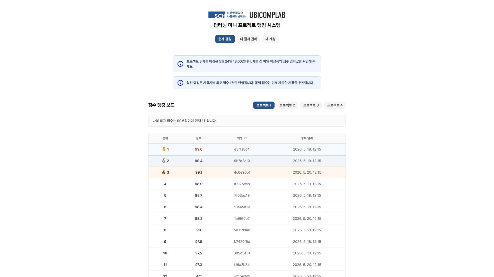
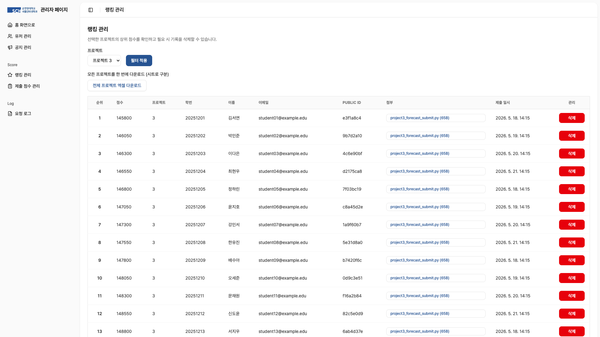
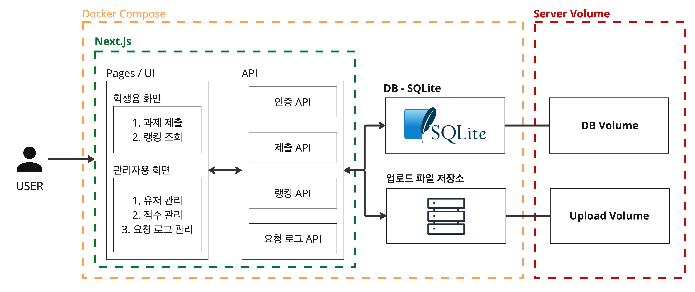
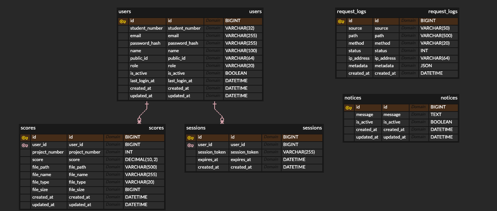
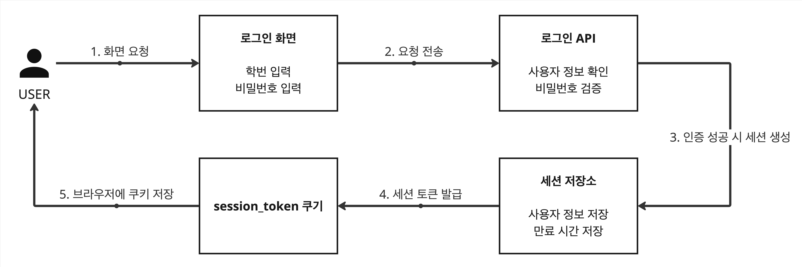
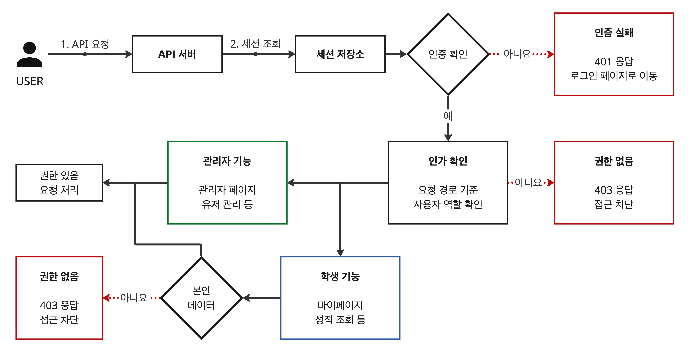
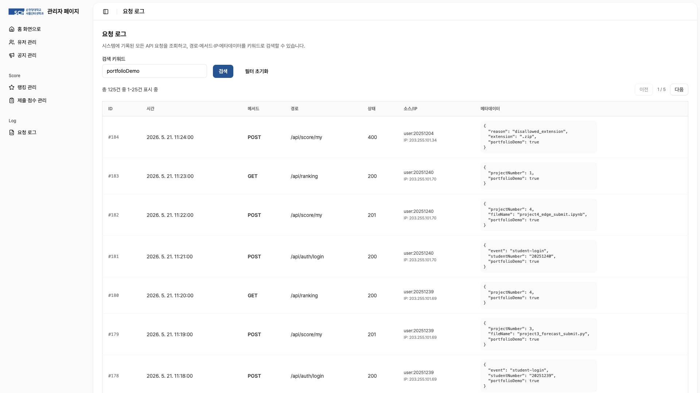

# SCH MiniProject PMS

Project No.3

순천향대학교 사물인터넷학과 ML/DL 강의에서 사용하는 프로젝트 과제 관리 시스템

Period
2025.06 ~ 2026.02
(약 10개월 - 개발 및 운영)

Position
순천향대학교 ML/DL 강의
개인 프로젝트

Role
Full-stack Developer

## 프로젝트 개요

순천향대학교 사물인터넷학과 머신러닝·딥러닝 강의에서 사용하는 **프로젝트 과제 관리 시스템**입니다. 기존 방식에서는 학생이 서로의 점수를 비교할 수 없어 자신의 결과 수준을 확인하기 어려웠고, 교수자는 제출 파일과 점수를 따로 확인해 순위를 직접 계산해야 했습니다. 이를 해결하기 위해 학생은 **결과를 제출하면 자신의 랭킹을 확인할 수 있고**, 교수자는 **학생 점수와 제출 파일을 웹에서 관리**할 수 있는 시스템을 구현했습니다. 실제 강의 성적에 반영되는 데이터를 다루기 때문에 점수 위변조를 막는 서버 측 검증을 포함해 세션 기반 사용자 관리, 감사 로그, 파일 업로드 검증을 구현했습니다. 이 시스템은 졸업 전까지 약 **10개월**간 직접 운영했으며, **현재도 강의 운영 환경에서 계속 사용**되고 있습니다. 현재 **월 평균 약 40명**의 학생이 과제 제출과 랭킹 조회 기능을 이용하고 있습니다.

## 역할

- 교수자 요구사항을 바탕으로 **과제 제출, 점수 비교, 랭킹, 관리자 기능의 요구사항 정리**
- 학생용 과제 제출/랭킹 화면과 교수자용 관리 화면의 **UI/UX 설계 및 프론트엔드 구현**
- **서버 세션 인증**, **역할 기반 접근 제어**, **서버 측 점수 검증**, **파일 업로드 검증**, **감사 로그** 개발
- **Docker Compose 기반 실행 환경 구성**과 졸업 전까지 배포 및 운영 대응

## 기술 스택

- **Next.js**
- **SQLite**
- **Docker Compose**
- Server Session + HttpOnly Cookie
- Server-side Score Validation
- File Upload Validation

## 과제 제출·랭킹 관리 시스템 구현

사용자는 프로젝트 결과와 점수를 웹으로 제출하고 **제출 후 바로 자신의 랭킹을 확인**할 수 있도록 구성했습니다. 교수자는 관리자 페이지에서 사용자 관리와 **제출 점수 집계**를 처리하고, 프로젝트별 랭킹을 한 번에 확인할 수 있습니다. 전체 랭킹은 **엑셀 형식으로 출력**해 성적 정리 과정에 바로 활용할 수 있도록 구성했습니다.

_전체 프로젝트 랭킹을 확인하는 학생 화면_

_프로젝트별 랭킹과 점수를 집계하는 관리자 화면_

## 운영 아키텍처와 데이터 구조

강의 서버에서는 Next.js 애플리케이션, SQLite DB, 제출 파일 저장 영역을 Docker Compose 환경에서 함께 운영했습니다. 월 평균 약 **40명** 규모의 강의 운영 시스템이라 별도 DB 서버를 두기보다 **SQLite**로 관리 비용을 낮췄고, DB 파일과 제출 파일은 각각 별도 볼륨으로 분리해 컨테이너 재시작 이후에도 데이터가 유지되도록 했습니다.

_운영 아키텍처 구성도_

_데이터 구조 ERD_

## 세션 기반 인증과 API 경로 기반 인가

강의 운영 시스템은 외부 서비스 연동보다 학생·관리자 권한을 서버에서 확실하게 통제하는 것이 중요했습니다. 그래서 토큰을 클라이언트에서 직접 다루는 방식보다 서버가 로그인 상태와 권한을 관리하는 세션 기반 인증을 선택했습니다. 인증은 학번 기반 로그인과 `session_token` 쿠키, 서버 세션을 기준으로 처리했습니다.

보호 경로에서는 세션을 먼저 확인하고, 학생용 API와 관리자용 API를 경로 기준으로 분리해 역할에 맞는 요청만 처리되도록 했습니다. 학생은 본인의 제출 결과와 랭킹 조회 기능에 접근하고, 관리자는 사용자 관리, 점수 집계, 제출 파일 확인 같은 운영 기능에 접근할 수 있도록 인가 범위를 나눴습니다.

_로그인 및 세션 발급 흐름_

_보호된 API 접근 및 경로 기반 인가 흐름_

## 파일 업로드 보안과 서버 검증 구현

제출 파일은 성적 처리의 근거가 되기 때문에 단순 첨부 파일이 아니라 검증 대상 데이터로 다뤘습니다. 입력 단계, 저장 단계, 다운로드 단계에서 필요한 확인을 나눠 적용했습니다.

### 프론트엔드 검증

프론트엔드에서는 **빈 파일을 먼저 차단**하고, **확장자 제한**을 적용해 .ipynb, .py 파일만 선택할 수 있게 했습니다. 이를 통해 서버 요청 전에 사용자 입력 오류를 줄였습니다.

### 서버 검증

**인증된 세션**이 있는 사용자만 제출할 수 있게 하고, 빈 파일과 **10MB 초과** 파일을 서버에서 차단했습니다. 업로드 확장자는 .ipynb, .py만 허용하고, 파일명 특수문자를 정리한 뒤 randomUUID를 붙여 저장 파일명 충돌을 방지했습니다. 파일은 사용자 ID별 디렉터리에 저장했고, 저장 전 업로드 루트와 저장 대상 경로를 각각 절대 경로로 변환한 뒤, 최종 경로가 **업로드 루트 내부**에서 시작하는지 확인했습니다. .ipynb는 JSON 파싱 후 cells 배열 존재 여부를 확인하고, .py는 null byte 포함 여부를 검사했습니다.

### 다운로드 보안

다운로드도 인증된 사용자만 가능하며, 제출 **소유자 또는 관리자**만 파일을 받을 수 있도록 확인했습니다. 저장된 파일 경로도 다시 검사해 업로드 루트 밖 파일이 응답되지 않도록 했습니다.

## 모니터링을 위한 요청 로그 관리 구현

성적 반영에는 점수뿐 아니라 제출 시간 등도 중요하기 때문에, 문제가 생겼을 때 누가 어떤 요청을 했는지 확인할 수 있어야 했습니다. 제출 실패, 로그인 실패, 점수 관리, 관리자 작업처럼 나중에 확인이 필요한 요청을 `request_logs` 테이블에 기록하고 관리자 페이지에서 조회할 수 있게 했습니다.

요청자, 경로, 메서드, 상태 코드, IP, 요청 메타데이터를 기록해 점수 처리와 제출 과정에서 발생한 문제를 추적할 수 있게 했습니다. 로그인 사용자는 `user:{id}`, 비로그인 요청은 `ip:{address}` 형태로 요청 출처를 남겼고, 관리자 페이지에서 요청 경로, method, status, IP, metadata 기준으로 검색하고 페이지네이션으로 조회할 수 있게 했습니다.

_요청 로그를 확인하는 관리자 화면_

## 내부망 DNS 문제로 인한 서비스 배포 실패 해결

### 문제

배포 과정에서 **Docker Compose가 필요한 이미지를 pull하는 단계에서 실패하는 문제**가 있었습니다. 로그 확인 결과 IP 주소 대상 ping은 성공했지만 **도메인 이름으로는 ping이 실패**해 DNS가 원인이라고 판단했습니다.

### 해결

처음에는 DNS 서버 IP 설정 문제라고 보고, 서버의 netplan 설정에서 `nameservers.addresses` 값을 Cloudflare DNS(**1.1.1.1**)와 Google DNS(**8.8.8.8**)로 지정해 공개 DNS로 변경해 확인했습니다. 하지만 도메인 이름으로는 ping이 계속 실패했습니다.

이후 원인을 다시 확인하면서, 학교 내부망에서는 외부 공개 DNS로 직접 질의하지 못하고 **학교 로컬 DNS 서버**를 통해 도메인을 해석해야 하는 구조일 가능성이 높다고 판단했습니다. 유실되어 있던 **학교 DNS 서버 IP**를 서버 DNS 설정에 반영했고, 도메인 해석과 **Docker Compose 배포가 정상 진행**되는 것을 확인했습니다.

## 회고 및 개선 방향

UI 디자인을 AI를 활용하여 진행했는데, 생각보다 원하는 분위기에 가깝게 나와 제작 과정이 즐거웠던 프로젝트였습니다. 성적에 반영되는 프로젝트이다 보니 **보안**을 최대한 신경 쓰려고 노력했지만 추후 검토 과정에서 놓친 부분들이 많았다는 것을 알게 되었습니다. 특히 **파일 업로드 보안**에서 단순한 확장자 검증과 구조 검증뿐만 아니라 **MIME type, 파일 signature**까지 확인해야 한다는 것을 알게 되어 후임자에게 해당 내용을 공유하고, 향후 시스템을 새로 구축할 때는 이러한 부분들을 보완해서 시스템을 설계해야겠다고 생각했습니다.
