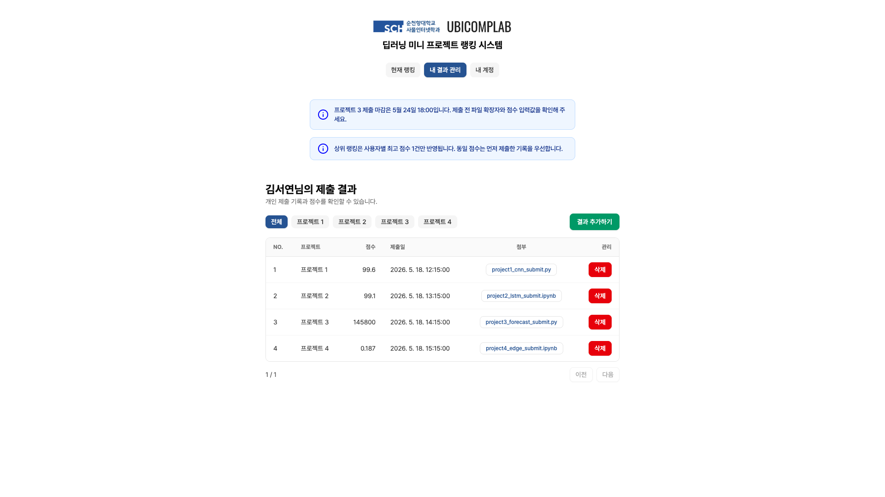
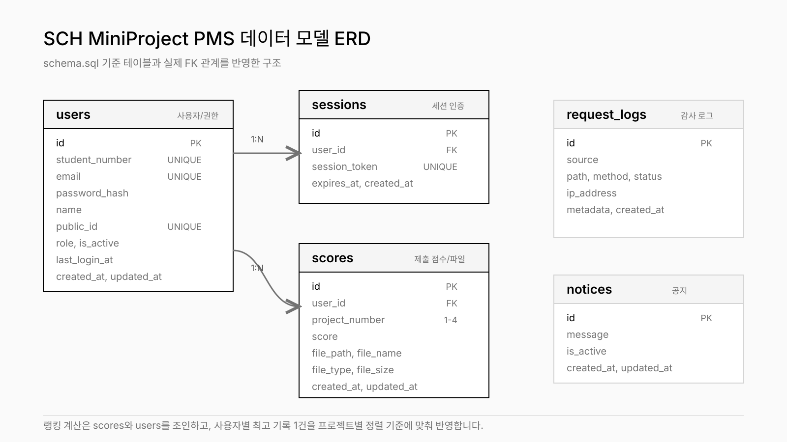

# SCH MiniProject PMS

Project No.3

순천향대학교 사물인터넷학과 ML/DL 강의에서 사용하는 프로젝트 과제 관리 시스템

Period
2025.06 ~ 2026.02
(약 10개월 - 개발 및 운영)

Position
순천향대학교 ML/DL 강의
개인 프로젝트

Role
Full-stack Developer

## 프로젝트 개요

순천향대학교 사물인터넷학과 머신러닝·딥러닝 강의에서 사용하는 **프로젝트 과제 관리 시스템**입니다. 기존 방식에서는 학생이 서로의 점수를 비교할 수 없어 자신의 결과 수준을 확인하기 어려웠고, 교수자는 제출 파일과 점수를 따로 확인해 순위를 직접 계산해야 했습니다. 이를 해결하기 위해 학생은 **결과를 제출하면 자신의 랭킹을 확인할 수 있고**, 교수자는 **학생 점수와 제출 파일을 웹에서 관리**할 수 있는 시스템을 구현했습니다. 실제 강의 성적에 반영되는 데이터를 다루기 때문에 점수 위변조를 막는 서버 측 검증을 포함해 세션 기반 사용자 관리, 감사 로그, 파일 업로드 검증을 구현했습니다. 이 시스템은 졸업 전까지 약 **10개월**간 직접 운영했으며, **현재도 강의 운영 환경에서 계속 사용**되고 있습니다. 현재 **월 평균 약 40명**의 학생이 과제 제출과 랭킹 조회 기능을 이용하고 있습니다.

## 역할

- 교수자 요구사항을 바탕으로 **과제 제출, 점수 비교, 랭킹, 관리자 기능의 요구사항 정리**
- 학생용 과제 제출/랭킹 화면과 교수자용 관리 화면의 **UI/UX 설계 및 프론트엔드 구현**
- **서버 세션 인증**, **역할 기반 접근 제어**, **서버 측 점수 검증**, **파일 업로드 검증**, **감사 로그** 개발
- **Docker Compose 기반 실행 환경 구성**과 졸업 전까지 배포 및 운영 대응

## 기술 스택

- **Next.js**
- **SQLite**
- **Docker Compose**
- Server Session + HttpOnly Cookie
- Server-side Score Validation
- File Upload Validation

## 과제 제출·점수·랭킹 통합 관리 시스템 개발

사용자는 프로젝트 결과와 점수를 웹으로 제출하고 **실시간으로 자신의 랭킹을 확인**할 수 있도록 구성했습니다. 교수자는 관리자 페이지에서 사용자 관리와 **제출 점수 집계**를 처리하고, 프로젝트별 랭킹을 한 번에 확인할 수 있습니다. 전체 랭킹은 **엑셀 형식으로 출력**해 성적 정리 과정에 바로 활용할 수 있도록 구성했습니다.

_프로젝트별 랭킹과 점수를 집계하는 관리자 화면_

_전체 프로젝트 랭킹을 확인하는 학생 화면_

_내 제출 결과와 프로젝트별 최고 점수를 확인하는 학생 화면_

## 성적 데이터를 다루기 위한 데이터 구조와 랭킹 기준

성적과 제출 파일을 함께 다루기 때문에 사용자, 세션, 점수, 공지, 요청 로그 데이터를 분리했습니다. 월 평균 약 **40명**의 학생이 사용하는 강의 운영 시스템이라 별도 DB 서버를 두기보다 **SQLite**로 관리 비용을 낮추고, Docker 볼륨으로 DB와 업로드 파일의 영속성을 확보했습니다.

_실제 schema.sql 기준으로 사용자, 세션, 점수, 공지, 요청 로그 테이블과 FK 관계를 정리한 ERD_

- `scores`와 `users` 데이터를 기준으로 랭킹을 계산하고, 사용자별 최고 기록 1건만 순위에 반영했습니다.
- 프로젝트 1·2는 높은 점수 순, 프로젝트 3·4는 낮은 점수 순으로 정렬하고, 동점이면 먼저 제출한 기록을 우선하도록 기준을 정했습니다.
- `request_logs`를 점수 제출, 로그인, 관리자 작업과 연결해 문제가 생겼을 때 요청 흐름을 추적할 수 있게 했습니다.

## 성적 데이터 보호를 위한 인증·인가·이중 검증

과제 점수는 실제 수업 성적에 반영되기 때문에 화면에서 보낸 값을 그대로 사용할 수 없었습니다. **학번 기반 로그인**, `session_token` 쿠키, 서버 세션을 기준으로 사용자를 식별하고, 학생 화면과 교수자 화면의 접근 범위를 분리했습니다.

- 서버 세션과 HttpOnly 쿠키로 인증 상태를 서버에서 관리하고, 보호 경로는 세션 쿠키를 기준으로 접근을 제어했습니다.
- 학생 화면, 관리자 화면, 점수 관리 API에 역할 기반 접근 검사를 적용했습니다.
- 프론트엔드에서는 프로젝트 번호, 점수 형식, 파일 확장자와 크기를 먼저 제한하고, 서버에서는 세션 사용자, 권한, 프로젝트 번호, 점수 형식, 파일 내용, 저장 경로를 다시 확인했습니다.
- 제출 파일은 `.ipynb`, `.py`만 허용하고, 다운로드 시 소유자 또는 관리자만 접근할 수 있도록 확인했습니다.

_서버 세션, 권한 검사, 서버 측 점수 검증을 기준으로 실제 성적 데이터의 접근 범위를 제한했습니다._

_프론트엔드 입력 제한과 서버 검증을 나눠 제출 파일과 점수 데이터의 비정상 입력 가능성을 낮췄습니다._

## 운영 중 문제 추적을 위한 감사 로그 관리

성적에 반영되는 시스템에서는 문제가 생겼을 때 누가 어떤 요청을 했는지 확인할 수 있어야 했습니다. 제출 실패, 로그인 실패, 점수 관리, 관리자 작업처럼 나중에 확인이 필요한 요청을 `request_logs` 테이블에 기록하고 관리자 페이지에서 조회할 수 있게 했습니다.

- 요청자, 경로, 메서드, 상태 코드, IP, 요청 메타데이터를 기록해 점수 처리와 제출 과정에서 발생한 문제를 추적할 수 있게 했습니다.
- 로그인 사용자는 `user:{id}`, 비로그인 요청은 `ip:{address}` 형태로 요청 출처를 남기도록 구성했습니다.
- 관리자 페이지에서 요청 경로, method, status, IP, metadata 기준으로 로그를 검색하고 페이지네이션으로 조회할 수 있게 했습니다.

_API 요청 결과를 감사 로그로 남기고, 운영 중 발생한 실패 요청을 관리자 화면에서 추적할 수 있도록 구성했습니다._

## 강의 서버 운영을 위한 Docker Compose 배포와 데이터 영속성

학과 내부망의 on-premise 강의 서버에서 같은 방식으로 실행하고 재시작할 수 있는 환경이 필요했습니다. 복잡한 배포 자동화보다 **Docker Compose 기반 실행 환경**과 **DB·업로드 파일을 유지하는 볼륨 구조**를 우선했습니다.

- Next.js 애플리케이션은 Docker Runtime에서 2025 포트로 실행되도록 구성했습니다.
- SQLite DB는 `/app/db`, 제출 파일은 `/app/uploads/evaluation-scores` 볼륨에 저장해 컨테이너 재시작 이후에도 데이터가 유지되도록 했습니다.
- `UPLOAD_ROOT`, `COOKIE_SECURE`, `PORT`, `NEXT_PUBLIC_APP_URL` 같은 환경 변수로 운영 환경을 조정할 수 있도록 구성했습니다.

_소규모 강의 운영에 맞춰 복잡한 인프라보다 재현 가능한 실행 환경과 데이터 영속성을 우선했습니다._

### 내부망 DNS 문제로 Docker pull이 실패한 배포 트러블슈팅

배포 과정에서 **Docker image pull이 계속 실패**했습니다. 서버 네트워크를 확인한 결과 IP 주소로는 ping이 나가지만 도메인 주소로는 실패했고, 이를 통해 단순 네트워크 단절이 아니라 **DNS 해석 문제**로 원인을 좁혔습니다. 학과 서버가 내부망에 있어 외부 DNS가 아니라 학교 네트워크의 DNS 서버를 사용해야 했고, 유실되어 있던 **학교 DNS 서버 IP를 복구**해 Docker pull이 정상 동작하도록 해결했습니다.

## 회고 및 개선 방향

이 프로젝트를 진행하면서 실제 강의 운영에 쓰이는 시스템은 기능 수보다 점수 데이터가 잘못 처리되지 않는 구조가 더 중요하다는 점을 배웠습니다. 랭킹 기능은 학생들에게 비교와 동기부여를 제공하는 기능이었지만, 실제 성적에 연결되는 순간 인증, 권한, 랭킹 계산 규칙, 로그, 업로드 검증, 실행 환경까지 함께 설계해야 하는 운영 시스템이 되었습니다.

- 사용자가 늘어나거나 여러 강의에서 동시에 사용한다면 SQLite에서 별도 DB 서버로 분리하는 개선이 필요합니다.
- 제출 파일 검증 외에도 저장소 격리, 악성 파일 탐지, Object Storage 이전 같은 보안·운영 개선을 검토할 수 있습니다.
- 요청 로그를 메트릭이나 알림 시스템과 연결해 운영 중 문제를 더 빠르게 확인할 수 있도록 확장할 수 있습니다.
