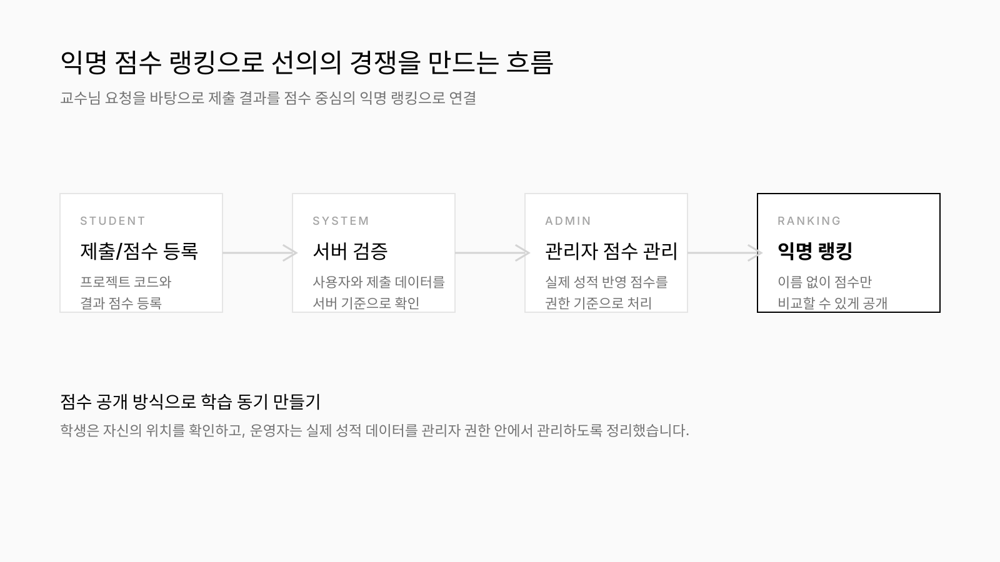
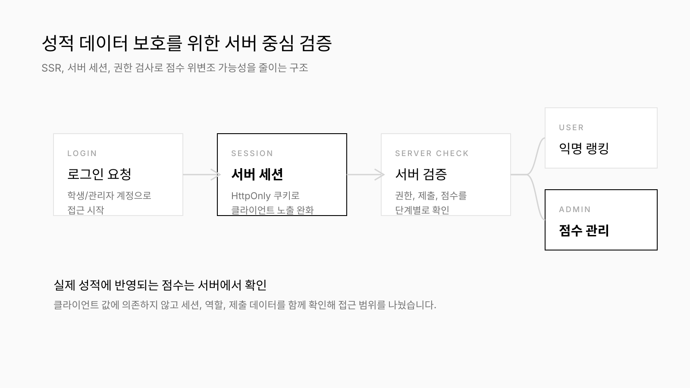
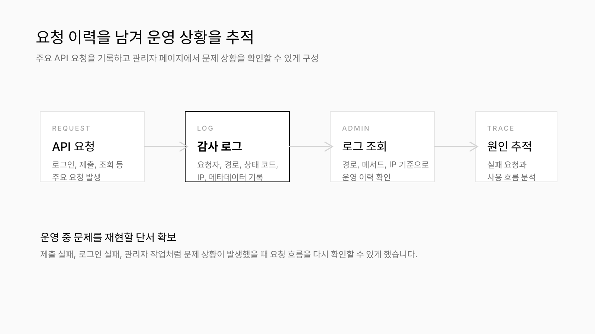
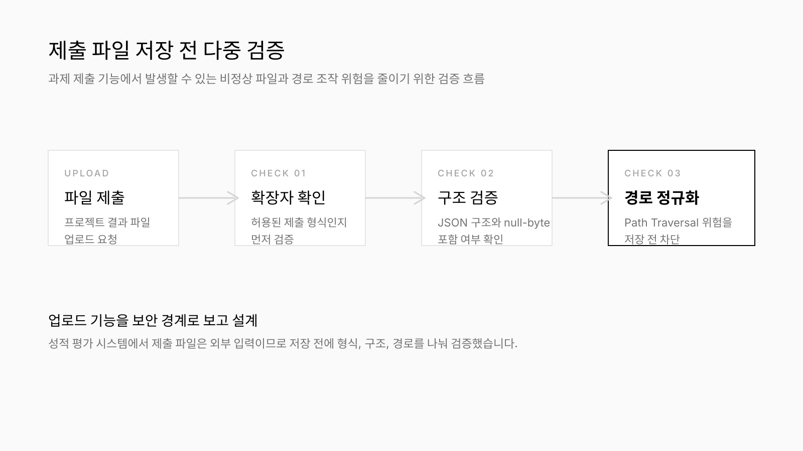
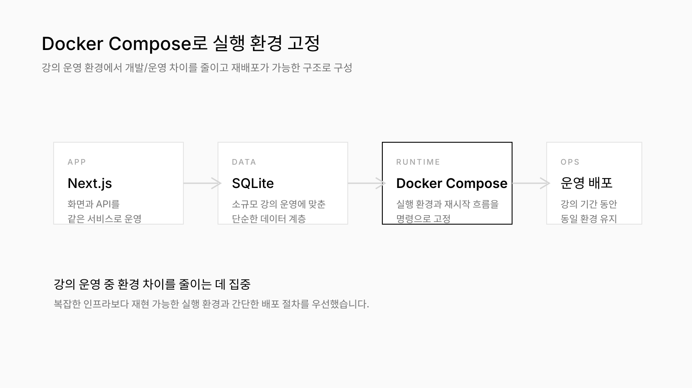

# SCH MiniProject PMS

Project No.3

순천향대학교 사물인터넷학과 ML/DL 강의에서 사용하는 프로젝트 과제 관리 시스템

Period
2025.06 ~ 2026.02
졸업 전까지 약 10개월 직접 개발 및 운영
현재도 강의 운영 환경에서 사용 중

Position
순천향대학교 ML/DL 강의
개인 프로젝트

Role
Full-stack Developer

## 프로젝트 개요

순천향대학교 사물인터넷학과 머신러닝·딥러닝 강의에서 사용하는 **익명 점수 기반 프로젝트 과제 관리 시스템**입니다. 기존 과제 제출 방식에서는 학생들이 서로의 프로젝트 결과를 비교할 수 없어 **자신의 결과가 어느 정도 수준인지 확인하기 어려웠고**, 교수자는 **제출 파일과 결과 점수를 따로 확인해 직접 순위를 매겨야 했습니다**. 이를 해결하기 위해 프로젝트 코드와 결과 점수를 제출하면 **익명 랭킹에서 자신의 순위와 다른 제출 결과의 점수를 함께 확인**할 수 있도록 설계했습니다. 실제 강의 성적에 반영되는 데이터를 다루기 때문에 **점수 위변조를 막는 서버 측 검증**, **세션 기반 사용자 관리**, **감사 로그**, **파일 업로드 검증**을 함께 설계했습니다. 이 시스템은 졸업 전까지 약 **10개월**간 직접 운영했으며, **현재도 강의 운영 환경에서 계속 사용**되고 있습니다. 월 평균 약 **40명**의 학생이 과제 제출과 랭킹 조회 기능을 이용하고 있습니다.

## 역할

- 교수자 요구사항을 바탕으로 **과제 제출, 점수 비교, 익명 랭킹, 관리자 기능의 범위 정의**
- **학생용 과제 제출/랭킹 화면**과 **교수자용 관리 화면**의 UI/UX 설계 및 구현
- **서버 세션 인증**, **역할 기반 접근 제어**, **서버 측 점수 검증**, **파일 업로드 검증**, **감사 로그** 개발
- **Docker Compose 기반 실행 환경 구성**과 졸업 전까지 배포 및 운영 대응

## 기술 스택

- **Next.js**
- **SQLite**
- **Docker Compose**
- Server Session + HttpOnly Cookie
- Server-side Score Validation
- File Upload Validation

## 수동 순위 산정을 줄이기 위한 제출·점수·랭킹 구조 설계

기존 방식에서는 교수자가 제출 파일과 결과 점수를 확인한 뒤 순위를 따로 계산해야 했습니다. 이 수동 작업을 줄이기 위해 **프로젝트 코드 제출, 결과 점수 저장, 익명 랭킹 조회**를 한 시스템 안에서 이어지도록 설계했습니다. 교수자가 DB를 직접 열지 않고도 제출 현황과 랭킹을 웹에서 관리할 수 있는 내부 운영형 서비스로 구성했습니다.

- 학생이 프로젝트별 점수와 결과 파일을 제출하면 **내 최고 점수와 현재 순위**를 같은 화면에서 확인할 수 있게 구성했습니다.
- 실명 대신 익명 식별자와 점수 중심으로 랭킹을 표시해 비교 경험은 제공하면서도 불필요한 개인 노출은 줄였습니다.
- 랭킹은 `scores`와 `users` 데이터를 기준으로 계산하고, 사용자별 최고 기록 1건만 순위에 반영했습니다.
- 프로젝트 1·2는 높은 점수 순, 프로젝트 3·4는 낮은 점수 순으로 정렬하고, 동점이면 먼저 제출한 기록을 우선하도록 기준을 정했습니다.

학생이 자신의 프로젝트 순위를 확인하는 익명 랭킹 화면과, 교수자가 프로젝트별 최고 기록을 확인하는 관리자 화면입니다. 학생에게는 비교에 필요한 점수와 순위만 보여주고, 교수자는 참가자 정보, 공개 ID, 제출 파일, 제출 시각, 순위를 한 화면에서 확인할 수 있도록 구성했습니다. 전체 프로젝트 랭킹은 엑셀 형식으로 내려받을 수 있게 했습니다.

_제출 결과를 익명 점수 랭킹으로 연결하고, 프로젝트별 평가 기준에 맞춰 순위를 계산하도록 구성했습니다._

## 성적 평가 데이터를 다루기 위한 세션 인증과 서버 측 점수 검증

과제 점수는 실제 수업 성적에 반영되기 때문에 화면에서 보낸 값을 그대로 사용할 수 없었습니다. **학번 기반 로그인**, `session_token` 쿠키, 서버 세션을 기준으로 사용자를 식별하고, 학생 화면, 교수자 화면, 점수 관리 API의 접근 범위를 분리했습니다.

- 서버 세션과 HttpOnly 쿠키를 사용해 인증 상태를 서버에서 관리하고, 보호 경로는 세션 쿠키를 기준으로 접근을 제어했습니다.
- 사용자 페이지, 관리자 페이지, 점수 관리 API에 역할 기반 접근 검사를 적용해 학생이 관리자 기능에 접근할 수 없도록 분리했습니다.
- 클라이언트가 보낸 점수는 세션 사용자, 프로젝트 번호, 점수 형식, 제출 파일 조건을 기준으로 서버에서 확인했습니다.
- 로그인, 회원가입, 점수 제출, 랭킹 조회 같은 주요 API 요청은 `users`, `sessions`, `scores`, `request_logs` 데이터와 연결되도록 구성했습니다.
- 랭킹, 점수, 관리자 데이터처럼 민감한 정보는 SSR과 서버 측 검증을 거쳐 처리하도록 설계했습니다.

_서버 세션, 권한 검사, 서버 측 점수 검증을 기준으로 실제 성적 데이터의 접근 범위를 제한했습니다._

## 운영 중 문제를 추적하기 위한 감사 로그 관리

성적에 반영되는 시스템에서는 문제가 생겼을 때 누가 어떤 요청을 했는지 확인할 수 있어야 했습니다. 제출 실패, 로그인 실패, 점수 관리, 관리자 작업처럼 나중에 확인이 필요한 요청을 `request_logs` 테이블에 기록하고 관리자 페이지에서 조회할 수 있게 했습니다.

- 요청자, 경로, 메서드, 상태 코드, IP, 요청 메타데이터를 기록해 점수 처리와 제출 과정에서 발생한 문제를 추적할 수 있게 했습니다.
- 로그인 사용자는 `user:{id}`, 비로그인 요청은 `ip:{address}` 형태로 요청 출처를 남기도록 구성했습니다.
- 관리자 페이지에서 요청 경로, method, status, IP, metadata 기준으로 로그를 검색하고 페이지네이션으로 조회할 수 있게 했습니다.

_API 요청 결과를 감사 로그로 남기고, 운영 중 발생한 실패 요청을 관리자 화면에서 추적할 수 있도록 구성했습니다._

## 제출 파일과 결과 데이터의 비정상 입력 차단

학생이 직접 파일과 결과 데이터를 제출하는 구조라 업로드 검증도 필요했습니다. 파일을 저장하기 전에 **프로젝트 번호, 점수 형식, 파일 확장자, 크기, 파일 내용, 저장 경로**를 확인해 비정상 업로드와 의도하지 않은 점수 데이터 입력 가능성을 낮췄습니다.

- 제출 파일은 `.ipynb`, `.py`만 허용하고, 파일 크기는 10MB 이하로 제한했습니다.
- `.ipynb` 파일은 JSON 구조를 확인하고, `.py` 파일은 null-byte 포함 여부를 검사했습니다.
- 파일은 사용자 ID별 디렉터리에 저장하고, DB에는 원본 파일명, 타입, 크기, 상대 경로를 저장했습니다.
- 다운로드 시 소유자 또는 관리자만 파일에 접근할 수 있도록 권한을 확인하고, 저장 경로가 업로드 루트 바깥으로 벗어나지 않도록 정규화했습니다.

_파일을 저장하기 전에 형식, 구조, 경로를 나눠 검증해 비정상 업로드 위험을 줄였습니다._

## Docker Compose 기반 실행 환경 통일과 내부망 배포 대응

강의 서버에서 같은 방식으로 실행하고 재시작할 수 있는 환경이 필요했기 때문에 Docker Compose로 실행 방식을 고정했습니다. 복잡한 배포 자동화보다 **DB와 업로드 파일을 유지할 수 있는 볼륨 구조**와 간단한 운영 절차를 우선했습니다.

- Next.js 애플리케이션은 Docker Runtime에서 2025 포트로 실행되도록 구성했습니다.
- SQLite DB는 `/app/db`, 제출 파일은 `/app/uploads/evaluation-scores` 볼륨에 저장해 컨테이너 재시작 이후에도 데이터가 유지되도록 했습니다.
- DB가 없으면 컨테이너 시작 시 `schema.sql`로 초기화되도록 구성했습니다.
- `UPLOAD_ROOT`, `COOKIE_SECURE`, `PORT`, `NEXT_PUBLIC_APP_URL` 같은 환경 변수로 운영 환경을 조정할 수 있도록 구성했습니다.
- on-premise 환경에서도 명령 기반으로 실행과 재시작을 관리할 수 있도록 구성했습니다.

_소규모 강의 운영에 맞춰 복잡한 인프라보다 재현 가능한 실행 환경을 우선했습니다._

### 내부망 배포 네트워크 이슈

#### Docker pull 실패 원인을 DNS 설정에서 찾음

학과 내부망 서버에 배포하는 과정에서 Docker image pull이 계속 네트워크 에러로 실패했습니다. 먼저 서버의 네트워크 연결 상태를 확인했고, IP 주소로는 ping이 나가지만 도메인 주소로는 ping이 실패하는 것을 확인했습니다. 이를 통해 단순 네트워크 단절이 아니라 DNS 해석 문제로 원인을 좁혔습니다.

- 처음에는 1.1.1.1, 8.8.8.8 같은 외부 DNS 서버로 변경해 해결을 시도했습니다.
- 하지만 학과 서버가 내부망에 있었기 때문에 외부 DNS가 아니라 학교 네트워크의 DNS 서버를 사용해야 한다는 점을 확인했습니다.
- 유실되어 있던 학교 DNS 서버 IP를 확인해 복구했고, 이후 Docker pull이 정상적으로 동작하도록 해결했습니다.
- Linux 환경에서 CLI로 IP, DNS, 네트워크 설정을 확인하고 수정했습니다.

## 개선 결과

- 학생은 제출 후 자신의 점수와 순위를 익명 랭킹에서 확인할 수 있게 되었고, 교수자는 제출 파일, 결과 점수, 순위, 요청 이력을 한 시스템에서 확인할 수 있게 되었습니다.
- 교수자는 DB를 직접 열지 않고도 사용자, 공지, 제출 기록, 랭킹, 요청 로그를 웹에서 관리할 수 있게 되었습니다.
- 프로젝트별 평가 기준, 사용자별 최고 기록, 동점 처리 기준을 랭킹 계산 로직에 반영해 교수자가 직접 순위를 계산하던 작업을 줄였습니다.
- 졸업 전까지 약 10개월간 직접 운영했으며, 현재도 강의 운영 환경에서 계속 사용되고 있습니다.
- 월 평균 약 40명의 학생이 과제 제출과 랭킹 조회 기능을 이용하고 있습니다.
- 실제 성적에 반영되는 점수 데이터를 다루기 위해 세션 인증, 권한 분리, 서버 측 점수 검증, 감사 로그, 파일 업로드 검증, Docker 볼륨 기반 실행 환경을 함께 적용했습니다.

## 기술 선택 이유

### Next.js

학생 화면, 관리자 화면, API를 함께 개발해야 했고, 랭킹과 관리자 데이터처럼 민감한 정보를 서버에서 처리해야 했기 때문에 Next.js를 사용했습니다. App Router 기반 화면과 API Route를 같은 애플리케이션 안에서 구성하고, 서비스 계층과 Repository 계층을 나눠 인증, 제출, 랭킹, 공지, 로그 기능의 책임을 분리했습니다.

### SQLite

월 평균 약 40명의 학생이 사용하는 강의 운영 시스템이었기 때문에, 별도 DB 서버를 운영하는 것보다 단순하고 관리 비용이 낮은 SQLite가 적합했습니다. `users`, `sessions`, `scores`, `notices`, `request_logs` 테이블로 사용자, 세션, 제출 점수, 공지, 요청 로그를 관리했습니다.

### Server Session + HttpOnly Cookie

실제 성적에 반영되는 점수와 관리자 기능을 다루기 때문에 사용자 식별을 서버 중심으로 관리해야 했습니다. `session_token` 쿠키와 세션 테이블을 사용해 인증 상태를 확인하고, 학생과 관리자의 접근 범위를 분리했습니다.

### Server-side Score Validation

점수 위변조를 막기 위해 클라이언트가 보낸 값을 그대로 신뢰하지 않고, 세션, 권한, 프로젝트 번호, 점수 형식, 제출 파일 조건을 서버에서 확인하도록 설계했습니다. 랭킹에 노출되는 점수도 서버에서 관리되는 `scores` 데이터를 기준으로 계산했습니다.

### Docker Compose

강의 서버에서 같은 방식으로 실행되어야 했기 때문에 Docker Compose로 실행 방식을 고정했습니다. SQLite DB와 업로드 파일을 볼륨으로 분리하고, 환경 변수로 실행 조건을 조정할 수 있게 해 컨테이너 재시작 이후에도 운영 데이터를 유지하도록 구성했습니다.

## 회고 및 개선 방향

이 프로젝트를 진행하면서 실제 강의 운영에 쓰이는 시스템은 기능 수보다 점수 데이터가 잘못 처리되지 않는 구조가 더 중요하다는 점을 배웠습니다. 익명 랭킹은 학생들에게 비교와 동기부여를 제공하는 기능이었지만, 실제 성적에 연결되는 순간 인증, 권한, 랭킹 계산 규칙, 로그, 업로드 검증, 실행 환경까지 함께 설계해야 하는 운영 시스템이 되었습니다.

- 사용자가 늘어나거나 여러 강의에서 동시에 사용한다면 SQLite에서 별도 DB 서버로 분리하는 개선이 필요합니다.
- 제출 파일 검증 외에도 저장소 격리, 악성 파일 탐지, Object Storage 이전 같은 보안·운영 개선을 검토할 수 있습니다.
- 요청 로그를 메트릭이나 알림 시스템과 연결해 운영 중 문제를 더 빠르게 확인할 수 있도록 확장할 수 있습니다.
